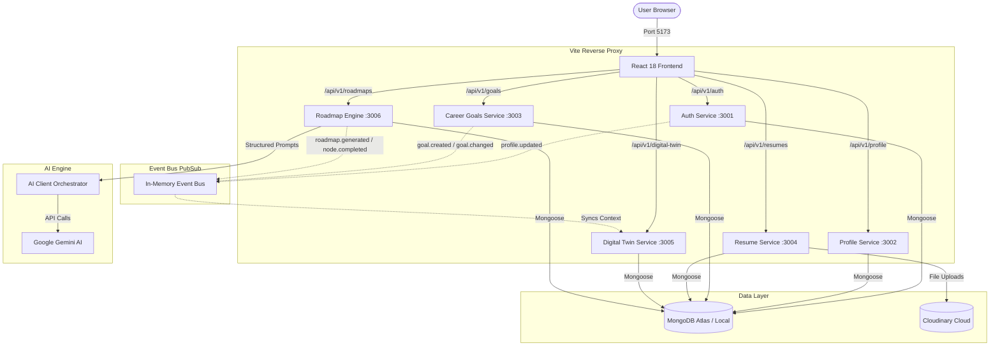

# 🚀 CareerOS AI — Complete Progress & Learning Guide

> **Target Audience:** Beginner to Intermediate Developers, Team Members, and Anyone Curious!  
> **Language:** Simple English + Hinglish Explanations (Easy analogies so you truly *understand* the code, not just copy-paste it).

---

## 📌 Table of Contents

1. [Big Picture: CareerOS AI Kya Hai? (The Vision)](#1-big-picture-careeros-ai-kya-hai-the-vision)
2. [High-End Engineering Concepts Made Simple](#2-high-end-engineering-concepts-made-simple)
   - [Monorepo & npm Workspaces](#a-monorepo--npm-workspaces)
   - [Microservices Architecture (Why not 1 big server?)](#b-microservices-architecture-why-not-1-big-server)
   - [Domain-Driven Design (DDD) & Data Ownership](#c-domain-driven-design-ddd--data-ownership)
   - [Event-Driven Architecture (Pub/Sub)](#d-event-driven-architecture-pubsub)
   - [The "Career Digital Twin" Concept](#e-the-career-digital-twin-concept)
   - [AI Client Orchestrator & Graceful Degradation](#f-ai-client-orchestrator--graceful-degradation)
   - [Reverse Proxy with Vite](#g-reverse-proxy-with-vite)
3. [What Has Happened So Far? (Phase-by-Phase Breakdown)](#3-what-has-happened-so-far-phase-by-phase-breakdown)
   - [Phase 0: Foundation & Core Packages](#phase-0-foundation--core-packages)
   - [Phase 1: Auth & User Profile](#phase-1-auth--user-profile)
   - [Phase 2: Career Goals Service](#phase-2-career-goals-service)
   - [Phase 3: Resume Service & ATS Scoring](#phase-3-resume-service--ats-scoring)
   - [Phase 4: AI Reasoning Engine (`@careeros/ai-client`)](#phase-4-ai-reasoning-engine-careerosai-client)
   - [Phase 5: AI Roadmap Engine (`services/roadmap-engine`)](#phase-5-ai-roadmap-engine-servicesroadmap-engine)
   - [Phase 10: Career Digital Twin (`services/digital-twin`)](#phase-10-career-digital-twin-servicesdigital-twin)
   - [Web Frontend (React 18 + Vite)](#web-frontend-react-18--vite)
4. [What Just Happened in Your Terminal? (Log Breakdown)](#4-what-just-happened-in-your-terminal-log-breakdown)
5. [Current System Architecture & Port Mapping](#5-current-system-architecture--port-mapping)
6. [What Should We Do Next? (Next Steps Roadmap)](#6-what-should-we-do-next-next-steps-roadmap)
7. [Developer Playbook & Cheatsheet](#7-developer-playbook--cheatsheet)

---

## 1. Big Picture: CareerOS AI Kya Hai? (The Vision)

Imagine you want to prepare for a **Full Stack Developer** interview at Google or Amazon.
Currently, people do this:
1. They go to LeetCode for DSA.
2. They go to Coursera/Udemy for tutorials.
3. They use random resume builders for ATS scores.
4. They ask ChatGPT random questions for mock interviews.

**The Problem:** None of these tools talk to each other! ChatGPT doesn't know what you studied yesterday, LeetCode doesn't know your resume projects, and your resume doesn't reflect your actual mock interview weakness.

### 💡 CareerOS Solution: The "Career Digital Twin"
**CareerOS AI** is an intelligent ecosystem that creates a **live digital replica of you** (your skills, learning roadmap progress, resume, target dream companies, and mock interview performance).
- If you finish a topic in your **Learning Roadmap**, your Digital Twin updates.
- When you do a **Mock Interview**, the AI asks questions targeting your weak areas from your roadmap and resume.
- If you fail an interview question on "Docker", the system updates your roadmap to recommend Docker practice!

---

## 2. High-End Engineering Concepts Made Simple

Let's understand the high-level architecture decisions we made in this codebase. (Bohot important for interviews and real-world system design!)

### A. Monorepo & npm Workspaces
* **What is it?** Instead of creating 8 different Git repositories (one for web, one for auth, one for ai, etc.), we put everything in **one single Git repository**.
* **How it's structured:**
  ```text
  CareerOS/
  ├── apps/              # User-facing applications (apps/web)
  ├── services/          # Independent Backend Microservices (auth, profile, goals, etc.)
  └── packages/          # Shared libraries used across services (logger, errors, ai-client, etc.)
  ```
* **Why do this?** Code reusability! If we define a TypeScript type (like `User` or `Roadmap`) inside `packages/shared-types`, both the Frontend (`apps/web`) and Backend (`services/roadmap-engine`) can import it directly. No copy-pasting types!

---

### B. Microservices Architecture (Why not 1 big server?)
* In a traditional beginner project (Monolith), everything runs on a single `app.js` or `server.ts` on port 5000.
* In **CareerOS**, we follow **Microservices**:
  - `services/auth` runs on **Port 3001**
  - `services/profile` runs on **Port 3002**
  - `services/career-goals` runs on **Port 3003**
  - `services/resume` runs on **Port 3004**
  - `services/digital-twin` runs on **Port 3005**
  - `services/roadmap-engine` runs on **Port 3006**
* **Simple Analogy:** Think of an airport. You have a Security Check counter, a Baggage Drop counter, and a Boarding Gate. If the Baggage counter gets crowded, Security still works! Similarly, if the Resume upload service takes time parsing a PDF, your Auth or Roadmap service doesn't freeze.

---

### C. Domain-Driven Design (DDD) & Data Ownership
* **Golden Rule of DDD:** *Each service owns its data. No other service can touch another service's database collection directly.*
* For example:
  - Only `services/career-goals` can write to the `goals` collection.
  - If the Digital Twin needs to know the user's active goal, it cannot run `db.goals.find()`. It must either ask via an API or listen to an Event!
* **Why?** Loose coupling (aazadi). If tomorrow `career-goals` changes its database schema, no other service breaks.

---

### D. Event-Driven Architecture (Pub/Sub)
* **How do services talk without being tightly coupled?** Through **Events**!
* **Analogy:** YouTube Notification Bell 🔔.
  - When a creator uploads a video (**Event: `video.uploaded`**), YouTube doesn't call 1 million subscribers individually. It publishes the event, and whoever subscribed gets notified.
* In CareerOS:
  - When the user generates a roadmap, `services/roadmap-engine` publishes `roadmap.generated`.
  - The `services/digital-twin` subscribes to `roadmap.generated` and updates the user's "Learning" profile automatically.
* In our current code, we use a lightweight in-memory event bus (`packages/event-bus`), which can easily be swapped with Redis or Apache Kafka in production without changing business logic!

---

### E. The "Career Digital Twin" Concept
The Digital Twin is divided into **7 isolated partitions**:
1. **Profile State:** Name, bio, education, experience.
2. **Career Goals:** Target role (e.g. "Full Stack Developer"), dream companies, timeline.
3. **Resume State:** Parsed resume, ATS keywords, matched skills.
4. **Learning State:** Active roadmap, completed topics, pending milestones.
5. **Skill State:** Verified skills vs skill gaps.
6. **Project State:** Completed hands-on projects and proof of work.
7. **Interview Readiness:** Mock interview scores, communication ratings, technical mastery.

When an AI interview starts, it queries the Digital Twin: *"Give me the user's context for an interview."* The Twin returns a combined snapshot so the AI can ask hyper-personalized questions.

---

### F. AI Client Orchestrator & Graceful Degradation
* **Never call Google Gemini or OpenAI directly from route handlers.**
* Instead, we built `packages/ai-client`:
  - Centralized API key management.
  - Structured output schemas with **Zod** (ensuring Gemini returns valid JSON, not conversational rambling).
  - Retry engine with exponential backoff.
  - **Graceful Degradation (Fallback Mechanism):** If the AI key is missing, network is down, or model rate limits occur, the system *does not crash*. It catches the error and serves a high-quality deterministic fallback curriculum!

---

### G. Reverse Proxy with Vite
* When your React app in `apps/web` (running at `http://localhost:5173`) calls `/api/v1/auth/login` or `/api/v1/roadmaps/generate`:
* Does browser give CORS errors? **No!**
* Inside `apps/web/vite.config.ts`, Vite acts as a reverse traffic cop:
  - `/api/v1/auth` ➡️ Forwarded to `http://localhost:3001`
  - `/api/v1/profile` ➡️ Forwarded to `http://localhost:3002`
  - `/api/v1/goals` ➡️ Forwarded to `http://localhost:3003`
  - `/api/v1/resumes` ➡️ Forwarded to `http://localhost:3004`
  - `/api/v1/digital-twin` ➡️ Forwarded to `http://localhost:3005`
  - `/api/v1/roadmaps` ➡️ Forwarded to `http://localhost:3006`

---

## 3. What Has Happened So Far? (Phase-by-Phase Breakdown)

Here is a quick recap of everything built and verified in the repository:

| Phase | Module | Port | Key Features Built |
|---|---|---|---|
| **Phase 0** | **Foundation** | - | Monorepo setup, shared packages (`@careeros/logger`, `@careeros/errors`, `@careeros/event-bus`, `@careeros/database`, `@careeros/shared-types`), MongoDB Mongoose connection. |
| **Phase 1** | **Auth & Profile** | `3001`, `3002` | User Registration, Login, JWT Access & Refresh Tokens, bcrypt password hashing, Profile management (`profile.updated` event). |
| **Phase 2** | **Career Goals** | `3003` | Target Role definition, Target Companies, Timeline, strictly enforced **"One Active Goal"** rule, `goal.created` & `goal.changed` events. |
| **Phase 3** | **Resume & ATS** | `3004` | Resume PDF upload, Cloudinary cloud storage, PDF text extraction, ATS Keyword matching against target role, ATS Score calculation (0-100%). |
| **Phase 4** | **AI Client Engine** | - | `packages/ai-client`: Unified Gemini interface, Zod output validation, token tracking, prompt templates. |
| **Phase 5** | **AI Roadmap Engine** | `3006` | Generates 3-tier curriculum (`Modules` ➡️ `Topics` ➡️ `Subtopics` & `Checklist Items`), Mandatory node protection (`MANDATORY_NODE_PROTECTED`), checklist toggle, progress %, fallback curriculum. |
| **Phase 10** | **Digital Twin** | `3005` | Event-driven partition aggregator, context generation API (`/api/v1/digital-twin/context`) for AI consumption. |
| **Frontend** | **Web Dashboard** | `5173` | React 18 UI with tabs: Dashboard, Profile, Career Goals, Resume & ATS Preview, Digital Twin Graph, and AI Learning Roadmap with interactive checkboxes! |

---

## 4. What Just Happened in Your Terminal? (Log Breakdown)

When you executed `npm run dev` and clicked "Generate AI Learning Roadmap", your terminal produced this log:

```text
[AUTH]     message: "Invalid or expired refresh token"
[AUTH]     statusCode: 401
[AUTH]     path: "/api/v1/auth/refresh"
```
🔍 **Explanation:** When you open the web app, it checks if you have an active session by attempting to refresh the JWT token. Since the cookie/token had expired, Auth correctly responded with 401. This is normal behavior when re-authenticating.

```text
[ROADMAP] INFO: Generating personalized learning roadmap
[ROADMAP] targetRole: "Full Stack Developer"
[ROADMAP] ERROR: AI generation error encountered. Falling back to deterministic curriculum.
[ROADMAP] err: {
[ROADMAP]   "type": "ConfigurationError",
[ROADMAP]   "message": "AI_FAST_MODEL must be configured."
[ROADMAP] }
```
🔍 **Explanation:** 
1. The web app called `POST /api/v1/roadmaps/generate`.
2. The Roadmap service checked your `.env` configuration for the Gemini AI fast model.
3. Because `.env` didn't have `AI_FAST_MODEL=gemini-1.5-flash`, the AI client threw `ConfigurationError: AI_FAST_MODEL must be configured.`
4. **The Magic of Graceful Degradation:** Instead of crashing the backend with a 500 error, our `aiGenerator.service.ts` caught the error, logged it cleanly, and automatically switched to the built-in deterministic curriculum for "Full Stack Developer"!

```text
[ROADMAP] INFO: Successfully persisted roadmap and dispatched roadmap.generated event
[ROADMAP] totalItemsCount: 9
```
🔍 **Explanation:**
- The fallback curriculum created 3 Modules (Frontend, Backend, Database/DevOps) with 9 actionable checklist topics.
- It saved this entire roadmap to MongoDB.
- It dispatched the `roadmap.generated` event.
- Your frontend UI instantly received the roadmap and rendered the complete interactive checklist!

---

## 5. Current System Architecture & Port Mapping



---

## 6. What Should We Do Next? (Next Steps Roadmap)

According to `todo-2.md` and the master architecture, here is the exact sequence of what we should build next:

### Step 1: Quick Configuration Fix (Optional for Live Gemini)
In your `.env` file, ensure these lines are present:
```env
AI_PROVIDER=gemini
GEMINI_API_KEY=your_actual_gemini_api_key_here
AI_DEFAULT_MODEL=gemini-1.5-pro
AI_FAST_MODEL=gemini-1.5-flash
AI_FALLBACK_MODEL=gemini-1.5-flash
```
*(We have already updated `.env_Example` so you don't miss this!)*

---

### Step 2: Phase 3 — Skill Tracking Service (`services/skill-tracking` on Port 3007)
* **What to build:**
  1. **Domain Models:**
     - `Skill`: Name, category (Frontend, Backend, Cloud), proficiency levels (Beginner, Intermediate, Advanced).
     - `UserSkill`: User's claimed skills + verified status.
     - `TargetRoleSkillRequirement`: Required skills for roles like "Full Stack Developer", "Data Scientist".
  2. **Skill-Gap Calculator:**
     - Compares the User's current skills against Target Role skills.
     - Computes the gap percentage (e.g., *"You have 70% of skills needed for Full Stack. Missing: Docker, Redis"*).
  3. **Event Publishing:**
     - Emits `skill.updated` so Digital Twin updates its `Skill State` partition.
  4. **APIs:**
     - `GET /api/v1/skills`
     - `POST /api/v1/skills`
     - `GET /api/v1/skills/gap-analysis`

---

### Step 3: Wire Roadmap Events to Digital Twin
* Currently, `services/roadmap-engine` emits `roadmap.generated` and `roadmap.node.completed`.
* We will register a listener in `services/digital-twin/src/bus.ts` so that whenever you check off a roadmap item, your Digital Twin's `Learning State` reflects real-time progress!

---

### Step 4: Phase 6 — Learning Progress Engine (`services/progress-engine` on Port 3008)
* **What to build:**
  - Multi-signal deterministic progress calculation.
  - Takes evidence from:
    1. Roadmap checklist completion (e.g. 40%)
    2. Topic quiz scores (e.g. 80%)
    3. Project submissions (e.g. 1 project completed)
  - Computes an overall **Mastery Index**.

---

### Step 5: Phase 11 & 12 — Mock Interview Engine (Practice & Company Simulation)
* **What to build:**
  - `services/interview/practice-mode`: AI Career Coach adaptive question generator using Digital Twin context.
  - `services/interview/company-mode`: Simulating real rounds (Google Technical Round 1, System Design, Behavioral).
  - Voice & Text response evaluation.

---

## 7. Developer Playbook & Cheatsheet

### 🛠️ Common Commands

| Command | What it does | When to run |
|---|---|---|
| `npm run build` | Compiles TypeScript in all `packages/*` to `dist/` | **Mandatory** before starting dev server or after modifying any package |
| `npm run dev` | Concurrently boots all 6 backend services + Vite React frontend | Everyday development |
| `npm test` | Runs all 16 Vitest test suites across the monorepo | Before committing code or after adding new features |
| `node test-mongo-connection.js` | Validates MongoDB credentials & network reachability | If database connection fails |

### 🧭 Port Reference Guide

| Port | Service | Health Endpoint |
|---|---|---|
| `5173` | Web Frontend | `http://localhost:5173` |
| `3001` | Auth Service | `http://localhost:3001/api/v1/auth` |
| `3002` | Profile Service | `http://localhost:3002/api/v1/profile` |
| `3003` | Career Goals | `http://localhost:3003/api/v1/goals` |
| `3004` | Resume Service | `http://localhost:3004/api/v1/resumes` |
| `3005` | Digital Twin | `http://localhost:3005/api/v1/digital-twin` |
| `3006` | Roadmap Engine | `http://localhost:3006/api/v1/roadmaps` |
| `3007` *(Next)* | Skill Tracking | `http://localhost:3007/api/v1/skills` |
| `3008` *(Next)* | Progress Engine | `http://localhost:3008/api/v1/progress` |

### ⚠️ Pro-Tips for Common Traps
1. **"Cannot find module '@careeros/shared-types'"**:
   - Always run `npm run build` at the root! Shared packages compile from TypeScript to JavaScript in `dist/`.
2. **"MongoServerSelectionError: getaddrinfo ENOTFOUND"**:
   - DNS resolution issue on some Wi-Fi / VPN networks. Uncomment `DNS_SERVERS=1.1.1.1,8.8.8.8` in your `.env`.
3. **"Port 300x already in use"**:
   - Run `lsof -i :3006` and `kill -9 <PID>` to free up ports if a process was stopped abruptly.

---

*Written with ❤️ for the CareerOS Engineering Team. Let's keep building and learning!*
